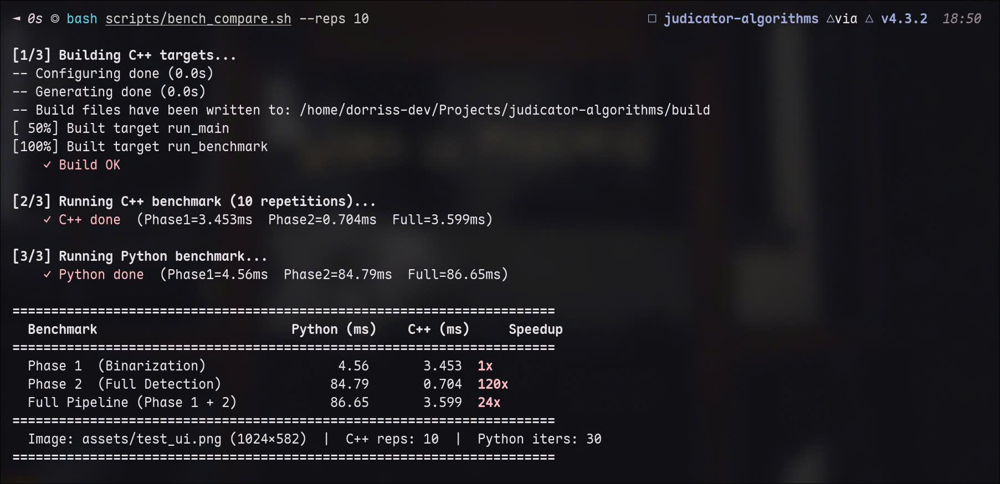

# UIED Port: High-Performance C++ Pipeline

A highly optimized C++ port of the UIED (UI Element Detection) Phase 1 (Binarization) and Phase 2 (Non-text Component Extraction) pipeline. This implementation replaces slow Python-based nested pixel loops, intensive per-pixel flood fill operations, and redundant memory copying with vectorized, native OpenCV functions and cache-friendly operations.

## Key Optimizations

- **O(1) Memory Allocation**: Replaced repeated full-image copying (`mask.copy()` and subtraction) during Python's flood-filling with inplace native contour extraction using `cv::findContours` (Suzuki-Abe algorithm).
- **Zero-Copy ROIs**: ROI-based analysis for boundary checks (`recognize_blocks`) instead of cloning sub-matrices.
- **Cache-Friendly Structures**: Storing detected elements in a contiguous `std::vector<UIComponent>` instead of boxed Python dictionaries, optimizing CPU L1/L2/L3 cache utilization.
- **No Python-to-C Bridge Overhead**: Direct calls to OpenCV algorithms in C++ without crossing the CPython API wrapper boundaries.

## Performance Benchmark

Below is the side-by-side performance comparison of the original Python implementation vs. the optimized C++ port. The benchmark was measured on a **16-core CPU @ 5.1 GHz** running Arch Linux, using `assets/test_ui.png` (1024×582px) with 30 Python iterations and 10 C++ Google Benchmark repetitions.



### Results Table

| Benchmark Stage | Python (ms) | C++ (ms) | Speedup |
| :--- | :--- | :--- | :--- |
| **Phase 1** (Binarization) | 4.56 ms | 3.453 ms | **1.32×** |
| **Phase 2** (Full Detection) | 84.79 ms | 0.704 ms | **120.44×** |
| **Full Pipeline** (Phase 1 + 2) | 86.65 ms | 3.599 ms | **24.08×** |

## Project Structure

```
├── assets/
│   ├── test_ui.png          # Input screenshot
│   └── benchmark.jpg        # Performance chart
├── include/
│   ├── uied_phase1.hpp      # Phase 1 interface
│   └── uied_phase2.hpp      # Phase 2 interface and configuration
├── src/
│   ├── main.cpp             # Execution driver, json exporter, annotator
│   ├── benchmark.cpp        # Google Benchmark suite
│   ├── uied_phase1.cpp      # Binarization logic
│   └── uied_phase2.cpp      # Component extraction, filtering, NMS, grouping
├── scripts/
│   ├── bench_compare.sh     # Side-by-side benchmarking wrapper script
│   └── bench_python.py      # Python reference benchmark script
└── CMakeLists.txt           # Build configuration
```

## Getting Started

### Prerequisites

Ensure you have the following installed:
- CMake (>= 3.10)
- OpenCV (core, imgproc, imgcodecs, highgui)
- Google Benchmark library
- Python 3 (venv setup is handled automatically by the comparison script)

### Build and Run

1. **Build and Run the main application**:
   ```bash
   mkdir -p build && cd build
   cmake -DCMAKE_BUILD_TYPE=Release ..
   make -j$(nproc)
   
   # Run the full pipeline
   ./run_main ../assets/test_ui.png
   ```
   *This outputs `output_binary.png`, `output_final.png`, and `output_compos.json` in the build folder.*

2. **Run C++ Benchmarks**:
   ```bash
   ./run_benchmark
   ```

3. **Run the Unified Comparison Script**:
   To compare performance against the Python implementation:
   ```bash
   cd ..
   bash scripts/bench_compare.sh --reps 10
   ```
